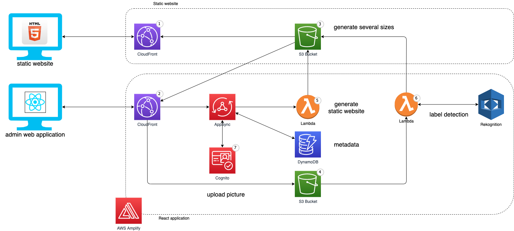

# Photo-sharing website

Static pre redered photo-sharing website to share publicly your pictures without needing to run or maintain servers


## The architecture




## Prerequisites
- [Create an AWS account](https://aws.amazon.com/fr/premiumsupport/knowledge-center/create-and-activate-aws-account/)
- [Install the Amplify CLI](https://docs.amplify.aws/cli/start/install#install-the-amplify-cli)
- [Configure Amplify](https://docs.amplify.aws/cli/start/install#configure-the-amplify-cli)
- [Install npm](https://www.npmjs.com/get-npm)

## Concept

- A static website  -> publicly accesible web app
- An admin web application  --> password protected web appplication (reactJs web application) used to generate the static website on demand

In the video bellow you can see how both works


You have a [youtube version](https://www.youtube.com/watch?v=nm4GbKUhm9U&ab_channel=ManBehindLens) of this video in higher resolution.

## Instructions

**1. Clone the repository**
  ```
  git clone https://github.com/cornelcroi/photo-sharing-website.git
  ```
**2. Preliminary operations**

- Admin user email
  - replace `your_emailaddress@domain.com` with your own email address in `amplify/backend/boostrap/adminuser/parameters.json`

- Image resize
  - The application resizes images using the `sharp` library packaged as Lambda Layer
  - The layer is deployed in `eu-west-1` AWS Region (from ) so you must deploy the application in this AWS Region. If you plan to deploy to a different Region, follow [this tutorial](https://aws.amazon.com/blogs/compute/using-lambda-layers-to-simplify-your-development-process) to create a sharp layer in that region and then update the layer arn in  `amplify/backend/function/S3TriggeraXXXX/S3TriggeraXXXX-cloudformation-template.json`

**3. Installs the dependencies**
  ```
  npm install
  ```


**4. Deploy the stack to your AWS account**
  - Initialize your Amplify powered cloud application
    ```
    amplify init
    ```
  - Provisions cloud resources with the local developments run
    ```
    amplify push
    ```
  - Publish static assets to Amazon S3
    ```
    amplify publish
    ```
Enjoy !


## Key points

  - the reactJs web application to allow authenticated users to create albums, upload photos and stored them in S3 and metadata in DynamoDB
  - a AWS Lambda generates the static files using html templates and using data stored in DynamoDB
  - the application built using AWS Amplify
  - full-stack ReactJs Application developped using AWS Amplify
  - there is a single admin user created at first deployment 
  - a AWS Lambda automatically creates photo thumbnails
  - Amazon Rekognition is used to automatically detects relevant labels for each uploaded photo and display these labels on album gallery page
  - static website (with html template files) is generated on demand by a AWS Lambda
  - static website sits in `./public/website` folder
  - there a 4 html templates
  ```
    /albums-gallery-template.html                                       <-- template for an album gallery page
    /albums-template.html                                               <-- template for list of albums page
    /album-item-template.html                                           <-- template for one album used in list of albums page
    /photo-item-template.html                                           <-- template for one photo used on album gallery page
  ```
  - each html template contains variables to be replaced by lambda like the piece of code bellow
  ```html
    <div>
      <h2>{ALBUM_NAME}</h2>
      <div>{ALBUM_PHOTOS} photos · {ALBUM_DATE}</div>
    </div>
  ```
  - amplify selected hosting option is S3 with CloudFront using HTTPS
    - the default  CloudFront distribution points to the root folder of hosting S3 bucket
    - the supplimentary CloudFront distribution points to `/website` subfolder in the hosting S3 Bucket (where the static website sits)


## Advantages of pre rendered static website ?

- pre-rendered static HTML of static sites loads much faster than the pages on a dynamic site. Fast websites are really important for a good user experience, and also for boosting your site in search engine rankings.
- static site generators reduce site complexity. That, in turn, improves speed and reliability, and smooths the developer experience.
- you don’t have to worry about database-toppling traffic spikes.
- you can host your site with a content delivery network that scales with your site’s traffic.
- lower costs
- better SEO
- good caching


 ## Tools

- The  [AWS Amplify JavaScript library](https://docs.amplify.aws/), to connect our front end to cloud resources
- [Amazon Cognito](https://aws.amazon.com/cognito/), to handle admin sign up authorization
- [Amazon Simple Storage Service (S3)](https://aws.amazon.com/s3/), to store and serve as many photos as I wish to upload,, to **host the reactjs app** assets for our app and to host the **static generated website**
- [Amazon CloudFront](https://aws.amazon.com/fr/cloudfront/), to store and serve as many photos as our users care to upload, and to host the static assets for our app

- [Amazon DynamoDB](https://aws.amazon.com/dynamodb/), to provide millisecond response times to API queries for album and photo data
- [AWS AppSync](https://aws.amazon.com/appsync/), to host a GraphQL API for our front end
- [AWS Lambda](https://aws.amazon.com/lambda/), to **create photo thumbnails** asynchronously in the cloud & to **generate the static website** on demand
- [Amazon Rekognition](https://aws.amazon.com/rekognition/), to detect 5 labels for each uploaded photo
   

## Costs
Less than a cup of coffee per month

## Credits

- [Multiverse HTML template](https://html5up.net/multiverse)
- [Lens HTML template](https://html5up.net/lens)
- [Build a Photo-Sharing Web App with AWS Amplify Workshop](https://amplify-workshop.go-aws.com/)
- [Create sharp layer for AWS Lambda](https://aws.amazon.com/blogs/compute/using-lambda-layers-to-simplify-your-development-process)
- [AWS Layer for Sharp ](https://github.com/woss/aws-lambda-layer-sharp)

